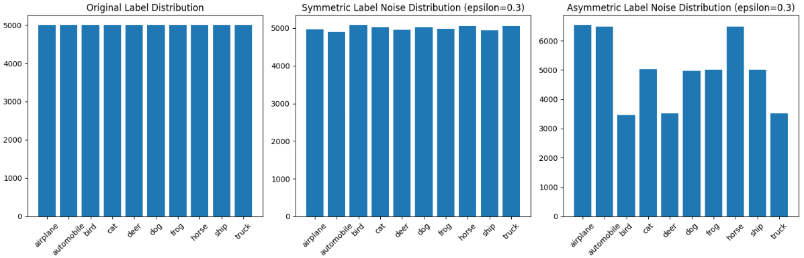
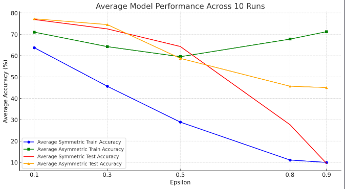
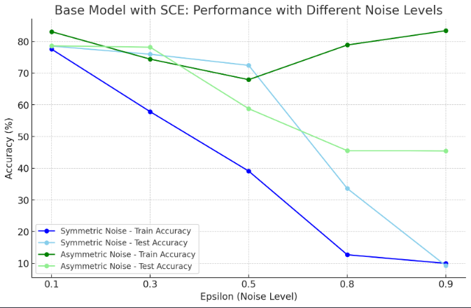
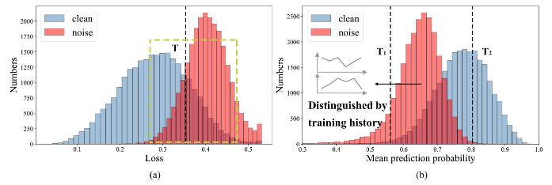
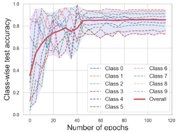
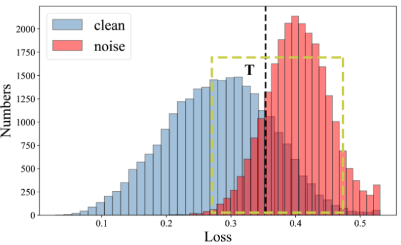

# Robust Learning with Noisy Labels

## Overview
This repository explores the impact of label noise on deep learning models and evaluates strategies to improve robustness against noise. We experiment with **ResNet-18** and **EfficientNet-B3**, implementing **Symmetric Cross-Entropy Loss (SCE)** and **Transfer Learning** to mitigate the negative effects of noisy labels.

## Dataset
We use the **CIFAR-10** dataset, which consists of 60,000 32x32 color images across 10 classes: airplane, automobile, bird, cat, deer, dog, frog, horse, ship, and truck.

We introduce two types of label noise:
- **Symmetric Noise:** Labels are randomly flipped with a probability \( \epsilon \).
- **Asymmetric Noise:** Labels are flipped based on predefined mappings (e.g., bird → airplane, truck → automobile).

### Label Distribution


## Methods
We implement the following approaches to improve noise resilience:

### 1. **Baseline ResNet-18 with Cross-Entropy Loss**
- A simple but effective CNN architecture.
- Susceptible to overfitting noisy labels.
- Provides a benchmark for improvement.



### 2. **ResNet-18 with Symmetric Cross-Entropy (SCE) Loss**
- Combines traditional **Cross-Entropy Loss (CE)** with **Reverse Cross-Entropy (RCE)**.
- Helps the model focus on clean samples while mitigating the effect of noisy labels.
- Significantly improves performance for moderate noise levels.



### 3. **EfficientNet-B3 with SCE Loss and Transfer Learning**
- Uses a **pre-trained EfficientNet-B3** model for feature extraction.
- Fine-tuned on the noisy dataset with **SCE Loss**.
- Offers superior performance compared to ResNet-18.

## Results
### **Effect of Noise on Model Accuracy**
The following plots illustrate how different levels of label noise impact train and test accuracy.

#### **Performance Across Different Noise Levels**


#### **Class-wise Convergence Trends**


#### **Separation of Clean and Noisy Samples**
We analyze the loss distribution of clean vs. noisy samples to identify effective thresholds for sample filtering.



## Conclusion
- **SCE Loss** provides a balanced tradeoff between noise resilience and model performance.
- **Transfer Learning with EfficientNet-B3** outperforms ResNet-18 by leveraging pre-trained features.
- Robust loss functions and sample selection techniques are critical for handling noisy labels.

## How to Run
1. Clone the repository:
   ```bash
   git clone https://github.com/your-username/noisy-labels.git
   cd noisy-labels
   ```
2. Install dependencies:
   ```bash
   pip install -r requirements.txt
   ```
3. Train the models:
   ```bash
   python train.py --model resnet18 --loss sce
   ```
   or
   ```bash
   python train.py --model efficientnet --loss sce --pretrained
   ```
4. Evaluate performance:
   ```bash
   python evaluate.py --model resnet18 --dataset cifar10
   ```

## Acknowledgments
This work is inspired by research on noise-resilient architectures and loss functions for deep learning models. References to related papers can be found in the report.

